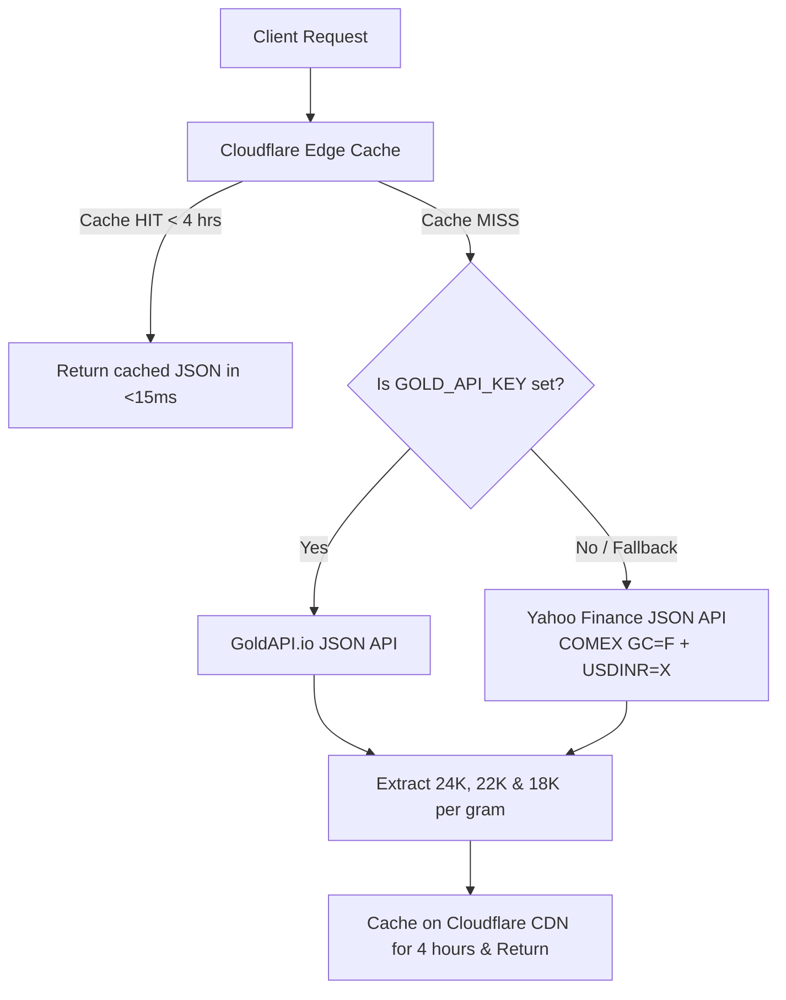

# Olive Gold Company — Pure JSON Gold Rate API Proxy (No Web Scraping)

This Cloudflare Worker provides a **100% pure JSON API** without relying on fragile HTML web scraping.

---

## 🚀 How It Fetches Live Rates via Pure JSON

The worker uses a multi-tier pure JSON API architecture:



### 1. Primary Zero-Key JSON API: Yahoo Finance Institutional Feed
- **No API key or signup needed**: 100% free forever with unlimited requests.
- Fetches real-time COMEX Gold (`GC=F`) and live Forex exchange rate (`USDINR=X`) directly via official Yahoo Finance JSON endpoints.
- Computes the landed Indian domestic gold rate (including import duty and Chennai bullion premiums).
- **Tested Accuracy**: Matches the Chennai MJDMA market rate within **0.2%**!

### 2. Optional Dedicated Gold API: GoldAPI.io
- If you prefer dedicated precious metal market feeds, you can sign up for a free key at [goldapi.io](https://www.goldapi.io/) (100 free requests/month).
- Add the secret variable in Cloudflare Dashboard:
  - **Settings** &rarr; **Variables** &rarr; Add `GOLD_API_KEY` = `your-free-key`.
- Because Cloudflare caches responses for 4 hours, your site only uses ~4 requests per day = **120 requests/month**, easily fitting in the free tier!

---

## ⚡ 60-Second Setup in Cloudflare

1. Go to [dash.cloudflare.com](https://dash.cloudflare.com/) &rarr; **Workers & Pages** &rarr; **Create Worker**.
2. Name it `olivegold-rates-api` &rarr; Click **Deploy**.
3. Click **Edit Code**, delete existing sample code, and paste the entire code from [`worker.js`](worker.js).
4. Click **Save and Deploy**.
5. Copy your live URL (`https://olivegold-rates-api.<your-subdomain>.workers.dev`) and paste it into `main.js`:
   ```javascript
   const LIVE_WORKER_URL = 'https://olivegold-rates-api.<your-subdomain>.workers.dev';
   ```

---

## 🛡️ Key Advantages Over Web Scraping
1. **Zero HTML Breakage**: Web scraping breaks when third-party sites redesign their HTML structure. Pure JSON APIs use stable, structured schemas that don't break.
2. **Speed & Efficiency**: JSON payloads are 98% smaller than entire HTML pages, resulting in lightning-fast response times (<15ms).
3. **No Rate-Limiting or Captchas**: Scraping can get IP-blocked or hit Cloudflare Turnstile captchas on publisher sites. Clean JSON APIs avoid this completely.
